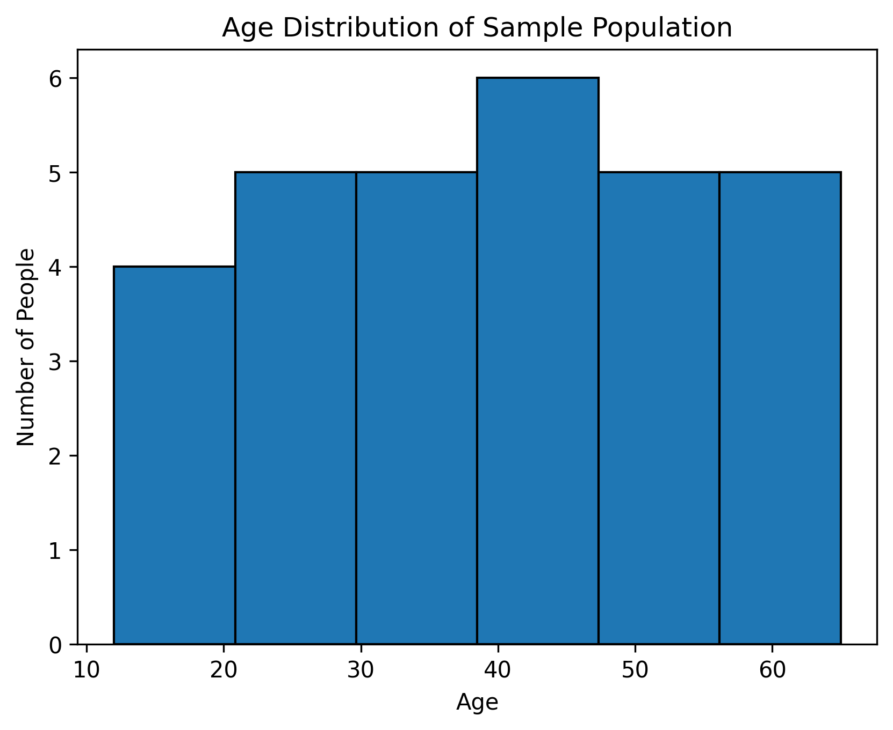

# Task 1 - Data Visualization

## Objective

Create a histogram to visualize the distribution of a continuous variable.

## Dataset

A sample population age dataset was used for this task.

## Tools Used

- Python
- Matplotlib
- Google Colab
- GitHub

## Approach

1. Created a sample dataset containing ages of individuals.
2. Imported Matplotlib for data visualization.
3. Created a histogram using the age data.
4. Divided the ages into six intervals using bins.
5. Added appropriate labels and a title.
6. Generated and saved the visualization as a PNG image.

## Visualization

## Observation

The histogram shows the distribution of ages in the sample population. The 40–50 age range has the highest frequency compared with the other age ranges. The visualization makes it easier to understand how the ages are distributed across the sample population.

## Conclusion

This task demonstrates how a histogram can be used to visualize the distribution of a continuous variable and identify patterns within a dataset.
